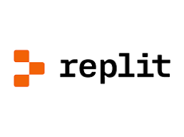
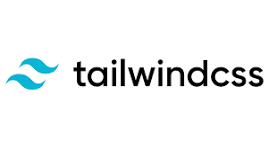
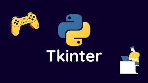
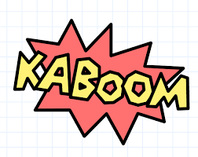
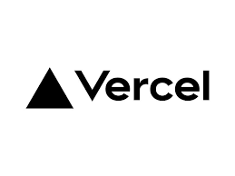

<h3 align="center">

  Welcome to Munawar Johar's profile!
  
</h3>
<!-- Typing SVG  - https://readme-typing-svg.herokuapp.com/demo/ -->
<h2 align="center" >
  
  </h2>
  
<!-- social -->

   
  &#8287;&#8287;&#8287;&#8287;&#8287;
  &#8287;&#8287;&#8287;&#8287;&#8287;
  
  &#8287;&#8287;&#8287;&#8287;&#8287;
  
  &#8287;&#8287;&#8287;&#8287;&#8287;
  
  &#8287;&#8287;&#8287;&#8287;&#8287;
  
  &#8287;&#8287;&#8287;&#8287;&#8287;
   
  &#8287;&#8287;&#8287;&#8287;&#8287;

  </a>
  </a>

  Hi, I'<a href="https://munawar-johar-io.vercel.app/"> Munawar Johar </a>,I have over 5 years of experience as a web developer.      I am proficient in HTML, CSS, JavaScript, and React.js. I am also familiar with a variety of web development frameworks, such as React, Next.js, and Node.js. I am a creative and innovative developer who is always looking for new ways to improve the user experience. I am also a team player and I am always willing to help others.
   

I am also a freelancer and have been working online for more than 2 years. I have completed many projects in my freelancing career. The most essential feature of me is that I am a reliable worker dedicating myself fully to my projects. Just handover your tasks to me and take a rest.
 
 
 - 🔭 I’m currently working on **Blockchain Development**
- 👨‍💻 All of my projects are available at [Projects](https://github.com/MunawarJohar?tab=repositories)
- 💬 Ask me about **Web Development, Python, C++, Github**
- 📄 Know about my [Experiences](https://munawar-johar-io.vercel.app/#resume)
- 👨‍💻 Hire Me as [Freelancer](https://www.linkedin.com/in/munawar-johar-520796240/)

<h2 align="left" id="naemazam">Certificates</h2>

>Professional Certificates

<table>
  <tr>
    <td align="center" width="96">
      
        Java Programming
    </td>
    <td align="center" width="96">
      
        Python Programming
    </td>
    <td align="center" width="96">
      
        Could Computing
    </td>
    <td align="center" width="96">
      
        Web Development
    </td>
     </tr>
</table>

<h2 align="left" id="naemazam">Dev-Hub</h2>

> Progamming languages

<table>
  <tr>
    <td align="center" width="96">
      
       Javascript
    </td>
    <td align="center" width="96">
      
       Python
    </td>
    <td align="center" width="96">
      
       Java
    </td>
    <td align="center" width="96">
      
       C++
    </td>
    <td align="center" width="96">
      
       markdown
    </td>
     <td align="center" width="96">
      
       HTML
    </td>
     <td align="center" width="96">
      
       My SQL
    </td>
  </tr>
  <tr>
    <td align="center" width="96">
      
       PHP
    </td>
    </tr>
</table>

> Frameworks and libraries

<table>
  <tr>
    <td align="center" width="96">
      
       bootstrap
    </td>
    <td align="center" width="96">
      
       Tailwind Css
    </td>
    <td align="center" width="96">
      
       React
    </td>
    <td align="center" width="96">
      
       Nodejs
    </td>
     <td align="center" width="96">
      
       Wordpress
    </td>
     <td align="center" width="96">
      
       Flask
    </td>
    <td align="center" width="96">
      
       Tkinter
    </td>
    <tr>
    <td align="center" width="96">
      
       Pygame
    </td>
      <td align="center" width="96">
      
       Kaboom
      </td>
    </tr>
    </tr>
</table>

> Databases and cloud hosting

<table>
  <tr>
    <td align="center" width="96">
      
       GitHub Pages
    </td>
    <td align="center" width="96">
      
       My SQL
    </td>
    <td align="center" width="96">
      
       Mongo DB
    </td>
    <td align="center" width="96">
      
       Vercel
    </td>
    <td align="center" width="96">
      
       Netlify
    </td>
    </tr>
</table>

> operating system

<table>
  <tr>
    <td align="center" width="96">
      
       Windows
    </td>
    <td align="center" width="96">
      
       Ubuntu OS
    </td>
        <td align="center" width="96">
      
       Linux OS
    </td>
    </tr>
</table>

> Software and tools
<table>
  <tr>
    <td align="center" width="96">
      
       Replit
    </td>
    <td align="center" width="96">
      
       Git
    </td>
    <td align="center" width="96">
      
       Visual Studio
    </td>
      <td align="center" width="96">
      
       Jupyter Notebook
    </td>
    <td align="center" width="96">
      
       Sublime
    </td>
      <td align="center" width="96">
      
       Postman
    </td>
        <td align="center" width="96">
      
       Command Prompt
    </td>
     <td align="center" width="96">
      
       Powershell
    </tr>
</table>

<!-- table emd-->

<!-- project table -->
 
## 💻 My top  projects
<table>
  <tr>
    <td>
    </td>
     <td>
    </td>
    <td>
    <td>
    </td>
  </tr> 

  <tr>
    <td><a href="https://github.com/MunawarJohar/FacebookClone"</a> 1 Facebook Clone</td>
        <td><a href="https://github.com/MunawarJohar/KaboomjsClone"</a> 2. KaboomJs CLone</td>
     <td><a href="https://github.com/MunawarJohar/Snake_Game"</a>3. Snake Game using Python </td>
     <td><a href="https://github.com/MunawarJohar/YouTubeClone"</a> 4. Youtube Clone  </td>
  </tr>

 <tr> 
  <td>
  
  </td>
  <td> <a></td>

  <td>
   
</td>

  <td>
   
</td>

 </tr>

   <tr>
    <td><a href="https://github.com/MunawarJohar/NoteApp"</a>5. NoteApp </td>
     <td><a href="https://github.com/MunawarJohar/GrammarlyClone"</a> 6. Grammarly Clone </td>
     <td><a href="https://github.com/MunawarJohar/Blog-Website-For-computer-concepts"</a>7. Computer Concepts Blog</td>
     <td><a href="https://github.com/MunawarJohar/QR-Code-Generator"</a>8. QR Code Generator</td>
  </tr>

  <tr> 
  <td>
  
  </td>
  <td> <a></td>

  <td>
   
</td>
 </tr>

 <tr>
    <td><a href="https://munawarjohar.github.io/Text_to_Voice.github.io/"</a>9. Text To Speech Converter </td>
     <td><a href="https://github.com/MunawarJohar/Text_Analyzer"</a> 10. Text Analyzer </td>
     <td><a href="https://github.com/MunawarJohar/Amazon_Clone.github.io"</a>11. Amazon Clone</td>
  
  </tr>
</table>

  

## 📘 My Course Source Code and Notes
<table>
  <tr>
    <td align="center" width="96">
      
        HTML Notes
    </td>
    <td align="center" width="110">
      
        CSS Notes
    </td>
    <td align="center" width="96">
      
        Python Notes
    </td>
</table>
 
  

  <h1 align="center">Summary Of My Github Status</h1>

  
 

 

  

<table align="center" border="1">
<tr align="center">
<td colspan="3"></td>
</tr>
<tr align="center">
<td></td>
<td></td>
<td colspan="3"></td>
</tr>

</table>

 

  <h1 align="center">Summary Of My Github Live Graph</h1>

  

  

  
